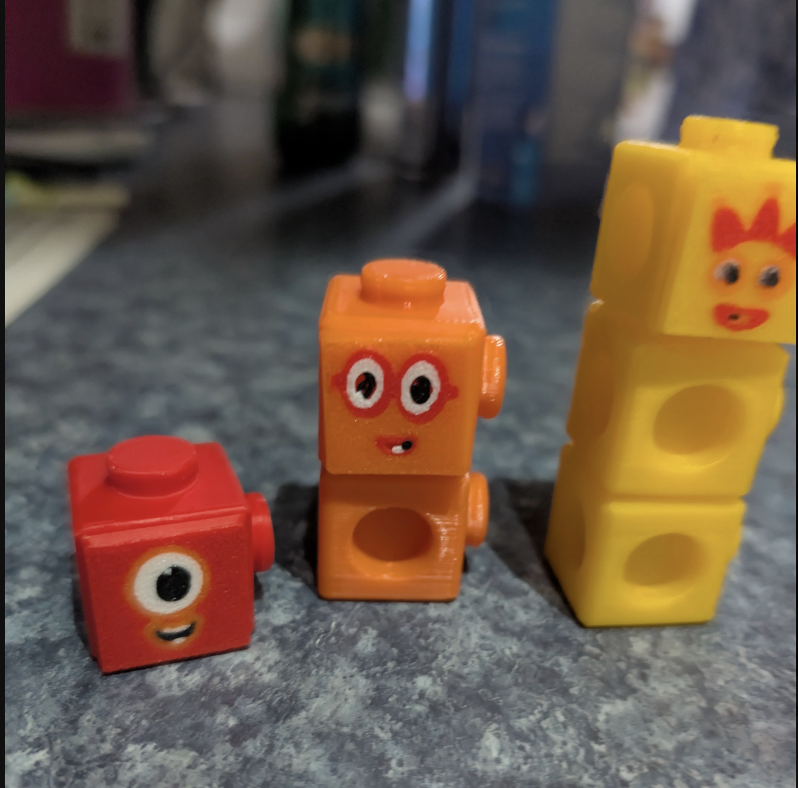

# NumberblockToysPrint

🚀 **[Live Demo](https://kylemath.github.io/NumberblockToysPrint)** 🚀

Print out numberblock toys and faces — generates AMS-ready multi-color faceplates for 3D printed Numberblocks toys.

## Screenshots

### 3D Printed Toys


### Faceplate Factory App


## Getting Started

### Prerequisites

List any prerequisites here.

### Installation

```bash
# Add installation instructions
```

### Usage

```bash
# Add usage examples
```

## License

Add license information here.

## Contributing

Contributions are welcome! Please feel free to submit a Pull Request.
